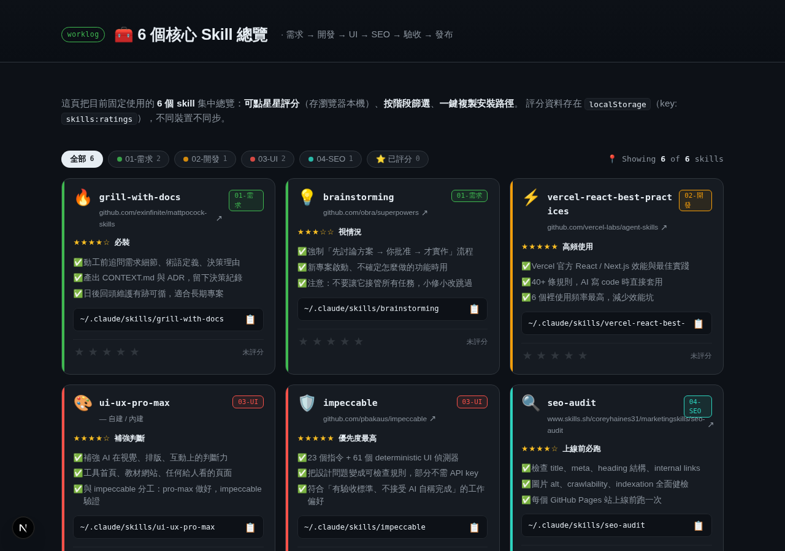

# Agent Skills Dashboard 🧰

一頁式 **Agent Skill Registry**：16 個 skill 集中管理，標註工程階段、跨 agent 相容性、依 ZCode 官方限制實測的 Skill Health，可搜尋、可篩選、可匯出成 plugin。交付檔為單檔 HTML、零依賴，丟上 GitHub Pages 即可上線。

> 線上版：<https://rita112025-cpu.github.io/agent-skills-dashboard/>



## ✨ 功能

| | |
|---|---|
| 🔎 **搜尋** | 名稱 / 階段 / 說明 / 來源 / 相依 / Agent 全文比對，多關鍵字 AND；按 `/` 聚焦、`Esc` 清除 |
| 🏷️ **三軸篩選** | 分類（Core / Optional）× 階段 × Agent 相容性，0 筆的階段自動隱藏 |
| 🤝 **Agent 相容性** | 每張卡列出 Claude Code / ZCode / Codex CLI / OpenClaw 的 `✓ 支援` `⚠ 部分` `? 未驗證` |
| 🩺 **Skill Health** | 對照 ZCode 官方限制逐項檢查並給 0–10 分（見下） |
| 🔗 **Skill 關聯** | 接在前 / 接在後 / 搭配，可點擊跳到對應卡片 |
| 🗺️ **流程 + 工具分離** | 7 個有順序的工程階段走 pipeline；元工具獨立在 Dev Tools 區 |
| ▶️ **推薦使用順序** | 4 條預設路線，一鍵複製 skill 名稱或安裝路徑 |
| 📦 **Plugin 匯出** | 產生 ZIP：`.zcode-plugin/plugin.json`、`.claude-plugin/plugin.json`、`registry.json`、取檔腳本、README |
| ⭐ **互動評分** | 存 `localStorage`，可匯出 / 匯入 JSON，換裝置不會消失 |
| 🌓 **暗 / 亮雙主題** | 存 `localStorage`，載入前先套用、不閃屏 |

## 🩺 Skill Health 怎麼算

檢查項對照 [ZCode 官方 Skill 文件](https://zcode.z.ai/en/docs/skill) 的硬限制：

| 檢查 | 依據 |
|---|---|
| `name` / `description` 存在 | 缺任一項，ZCode 直接拒絕該 skill |
| `description` ≤ 1024 字元 | 超過會讓整個 skill 被丟棄（非截斷） |
| body < 100 KB | 超過會在載入時被截斷 |
| 無 Claude 專屬 frontmatter | `disable-model-invocation` / `allowed-tools` / `user-invocable` 等換平台不一定認得 |
| 無外部相依、無 MCP 需求 | 需要另外裝 CLI 或 MCP server 的會扣分 |
| 來源路徑已核對 | repo 內 `SKILL.md` 路徑實際存在 |

`pass = 1 分`、`warn = 0.5 分`、`fail = 0 分`，換算成 10 分制。

**沒有抓到來源的 skill 不會假裝通過** —— `ui-ux-pro-max`（自建）與 `seo-audit`（來源在 skills.sh 非 GitHub）的相關項目一律標示「未驗證」並排除在分母外，卡片上會顯示「N 項未驗證」。

各 skill 的 `meta` 欄位（frontmatter 欄位、description 字數、body 大小）是 **2026-09-16 實際抓取各來源 repo 的 `SKILL.md` 量測**得出，不是估的。

## 🔖 版本追蹤

每張卡片的來源連結下面會多一行，例如：

```
✓ 447ca70 上游最後修改 2026-08-15 · 2026-09-16 驗證
```

`447ca70` 不是 repo 的 HEAD，是這個 skill 對應的 `SKILL.md` **那個路徑本身**最後一次被修改時的 commit —— repo 裡其他檔案異動不會讓這裡跳動，只有真的動到這份 `SKILL.md` 才算。

三種狀態：

| 狀態 | 意思 |
|---|---|
| `verified` | 有拿到 GitHub API 回傳的 commit，卡片顯示 commit + 兩個日期 |
| `unavailable` | 沒有公開來源可查（`ui-ux-pro-max` 自建、`seo-audit` 來源在 skills.sh），卡片上**不會**顯示版本列，不假裝有 |
| `error` | 查過但這次 API 失敗（網路 / rate limit / repo 改名），沿用上次記錄的 commit 並標黃色警告，不會裝作沒事 |

重新查一次所有版本：

```bash
bun run check:versions
# 或
node scripts/check-versions.js
```

跑完會直接改寫 `data/skills.json` 的 `version` 欄位，記得跟著跑一次 `bun run build:showcase`。這支腳本走的是 GitHub 公開 API（未認證，60 次 / 小時），16 個 skill 遠低於限制；要提高額度可設 `GITHUB_TOKEN` 環境變數。

`version` 是**基準**——釘住之後不會自己變。要知道基準有沒有落後上游，要另外跑重檢。

### GitHub 自動重檢

```bash
bun run recheck:versions
# 或
node scripts/recheck-versions.js
```

重檢跟設定基準是兩支分開的腳本，故意不共用邏輯：

| | `check:versions` | `recheck:versions` |
|---|---|---|
| 做的事 | **設定 / 更新**基準版本 | **比對**基準跟最新版本 |
| 會改 `version` 欄位 | 會 | **不會** |
| 寫入欄位 | `version` | `recheck` |

重檢只負責把「有沒有落後」攤開來，**不會自動更新基準**——上游真的改了 `SKILL.md`，不代表要立刻跟著換，中間應該有人看過實際 diff 再決定要不要重新 `check:versions` 釘一個新基準。卡片上會多一行：

```
⟳ 重檢於 2026-09-16：與基準一致          ← 沒有落後
⚠ 重檢於 2026-09-16：上游已改到 9f2a1b3（2026-09-17），基準尚未更新   ← 落後了，等你決定
```

四種 `recheck.status`：

| 狀態 | 意思 |
|---|---|
| `unchanged` | 最新 commit 跟基準一樣 |
| `changed` | 最新 commit 跟基準不一樣，卡片顯示黃色警告 |
| `unavailable` | 基準本身就是 `unavailable`（沒有公開來源），不打 API，卡片不顯示重檢列 |
| `error` | 基準是 `error`（沒有可信基準可比），或這次查詢本身失敗；沿用上次資料並標警告 |

build 腳本會驗證 `recheck` 資料本身不能自相矛盾——例如標成 `unchanged` 但 `latestCommit` 跟 `baselineCommit` 不同，或標成 `changed` 但兩者其實一樣，這種資料錯誤會直接讓 build 失敗，不會生出看起來正常但內容矛盾的頁面。

這是「拿記錄的版本跟最新版本比對、標出誰改過」的完整資料基礎。

## 🕸️ 依賴關係圖

在工作流程之後、推薦流程之前，有一張 SVG 畫的依賴關係圖：16 個 skill 依工程階段分欄，欄與欄之間用箭頭連起來。手畫的節點座標 + 貝茲曲線，沒有外部圖表函式庫（`public/showcase.html` 仍是零依賴單檔）。

**邊怎麼來的：**

| 邊的樣式 | 資料來源 | 意思 |
|---|---|---|
| 實線 + 箭頭 | `relations.after` / `relations.before` | 有先後順序：箭頭起點先用，箭頭終點後用 |
| 虛線 | `relations.with` | 互補搭配，沒有先後之分 |
| 節點右上角的小圓點數字 | `deps` | 這個 skill 有幾個「不在 registry 裡」的外部相依（另裝的 CLI、其他 skill） |

`relations.after` 跟 `relations.before` 不要求兩邊互相宣告——只要任一邊寫了，圖上就畫得出邊。例如 `seo-audit` 的 `relations.after` 寫了 `impeccable`，即使 `impeccable` 自己沒有把 `seo-audit` 列進 `relations.before`，這條邊依然會出現（並在 hover `impeccable` 時一起亮起來）。

**互動：**

- 點節點 = 跳到對應卡片，閃一下外框（跟卡片裡的「接在前 / 接在後 / 搭配」按鈕共用同一個 `gotoSkill()`）
- Hover 節點 = 亮起跟它相連的邊，其他邊淡出，看得出「這個 skill 到底跟誰有關係」
- 跟上方的搜尋 / 篩選同步——篩掉的 skill，節點也會一併變淡（不用重新畫整張圖，只是淡出）

**外部相依（`deps`）不會被畫成圖節點**——它們不在這個 registry 裡，沒有階段、沒有 Health、沒有相容性資料，硬畫成節點只是假裝有資料。改成圖下方一份純文字清單：

```
grill-with-docs  需要 → grilling、domain-modeling
impeccable       需要 → impeccable CLI
grill-me         需要 → grilling
agent-browser    需要 → agent-browser CLI (npm)
```

build 腳本會擋兩種壞資料：`relations` 指向自己（會畫出自我迴圈）、`deps` 裡有空字串或非字串項目。

## 📦 Skill 清單

### Core 6

| Skill | 階段 | 來源（已核對路徑） |
|---|---|---|
| grill-with-docs | 01-需求 | [mattpocock/skills](https://github.com/mattpocock/skills) `skills/engineering/grill-with-docs/` |
| brainstorming | 01-需求 | [obra/superpowers](https://github.com/obra/superpowers) `skills/brainstorming/` |
| vercel-react-best-practices | 02-開發 | [vercel-labs/agent-skills](https://github.com/vercel-labs/agent-skills) `skills/react-best-practices/` |
| ui-ux-pro-max | 03-UI | 自建（無公開來源） |
| impeccable | 03-UI | [pbakaus/impeccable](https://github.com/pbakaus/impeccable) `.claude/skills/impeccable/` |
| seo-audit | 04-SEO | [skills.sh](https://www.skills.sh/coreyhaines31/marketingskills/seo-audit) |

### Optional 10

| Skill | 階段 | 來源（已核對路徑） |
|---|---|---|
| grill-me | 01-需求 | [mattpocock/skills](https://github.com/mattpocock/skills) `skills/productivity/grill-me/` |
| prototype | 02-開發 | [mattpocock/skills](https://github.com/mattpocock/skills) `skills/engineering/prototype/` |
| subagent-driven-development | 02-開發 | [obra/superpowers](https://github.com/obra/superpowers) `skills/subagent-driven-development/` |
| frontend-design | 03-UI | [anthropics/skills](https://github.com/anthropics/skills) `skills/frontend-design/` |
| image-to-code | 03-UI | [leonxlnx/taste-skill](https://github.com/leonxlnx/taste-skill) `skills/image-to-code-skill/` |
| diagnosing-bugs | 05-測試 | [mattpocock/skills](https://github.com/mattpocock/skills) `skills/engineering/diagnosing-bugs/` |
| agent-browser | 06-驗收 | [vercel-labs/agent-browser](https://github.com/vercel-labs/agent-browser) `skills/agent-browser/` |
| find-skills | T-工具 | [vercel-labs/skills](https://github.com/vercel-labs/skills) `skills/find-skills/` |
| skill-creator | T-工具 | [anthropics/skills](https://github.com/anthropics/skills) `skills/skill-creator/` |
| mcp-builder | T-工具 | [anthropics/skills](https://github.com/anthropics/skills) `skills/mcp-builder/` |

### ⚠️ 已知的名稱落差

| Dashboard 顯示 | repo 目錄名 | 說明 |
|---|---|---|
| `vercel-react-best-practices` | `react-best-practices` | 目錄名與 frontmatter `name` 不同，安裝路徑用目錄名 |
| `image-to-code` | `image-to-code-skill` | 同上 |

`grill-with-docs` 與 `grill-me` 的 `SKILL.md` 本體只有幾行，實際邏輯在 `grilling` / `domain-modeling`；**只用 Claude Code 可以不管，要跨平台就必須一起裝**。

## 🗺️ 階段

工程階段（有先後順序，走 pipeline）：

```
01 需求 → 02 開發 → 03 UI → 04 SEO → 05 測試 → 06 驗收 → 07 發布
```

`07-發布` 目前沒有對應 skill，流程圖會標示為手動步驟。

開發工具（**不在流程線上**）：`find-skills` · `skill-creator` · `mcp-builder` —— 它們是產生新能力的元工具，和「需求 → 發布」不是同一個維度，所以獨立顯示。

## 📦 Plugin 匯出

點「下載 Plugin ZIP」會產生：

```
six-skills-plugin.zip
├── .zcode-plugin/plugin.json      # ZCode plugin manifest
├── .claude-plugin/plugin.json     # Claude Code（勾選時才產生）
├── registry.json                  # 完整 registry + health 結果
├── fetch-skills.sh                # macOS / Linux
├── fetch-skills.ps1               # Windows
└── README.md                      # 清單表格 + ZCode 限制說明
```

**ZIP 內不含第三方 `SKILL.md` 內文** —— 著作權屬各原作者，本專案不轉載。改為附上已核對過的 raw URL 與取檔腳本：

```bash
unzip six-skills-plugin.zip -d six-skills && cd six-skills
bash fetch-skills.sh          # 抓回 14 個真正的 SKILL.md 到 skills/
cp -r skills/* ~/.claude/skills/
```

`ui-ux-pro-max`（自建）與 `seo-audit`（非 GitHub）沒有 raw URL，腳本會明確列出略過。

ZCode 也可以直接在 Settings → Skills 匯入既有的 Claude Code skill 目錄（symlink 或 copy），不一定要走 plugin。

## 🚀 本機執行

```bash
npx serve public     # 或任何靜態伺服器 → 開 showcase.html
```

也可以跑 Next.js 外殼（主頁以全螢幕 iframe 載入同一份交付檔）：

```bash
bun install && bun run dev    # http://localhost:3000
```

### 部署到 GitHub Pages

`public/showcase.html` 是單檔零依賴，改名 `index.html` 放進任何靜態空間即上線，不需要 Node。

## 🛠️ 維護方式

`public/showcase.html` 是**生成出來的檔案**，不要直接手改它的資料。真正的資料來源是 `data/*.json`：

| 檔案 | 用途 |
|---|---|
| `data/skills.json` | registry 本體。加 skill = 加一個物件 |
| `data/stages.json` | 階段 → `kind:"pipeline"` 進流程圖、`kind:"tool"` 進 Dev Tools 區 |
| `data/agents.json` | 支援的 agent 平台與各自的 skills 目錄 |
| `data/recipes.json` | 推薦使用順序 |
| `data/not-recommended.json` / `data/checklist.json` | 不建議安裝清單、自我驗證清單 |
| `data/zcode-limits.json` / `data/claude-only-keys.json` | ZCode 官方限制、Claude 專屬 frontmatter 欄位，Health 檢查的依據 |

改完 JSON，執行：

```bash
node scripts/build-showcase.js
# 或
bun run build:showcase
```

**UI 上的每個數字都是從這些資料推導出來的，沒有寫死**（加到 30 個 skill 也不用改任何文案）。`bun run dev` / `bun run build` 前會自動跑一次（`predev` / `prebuild` hook），一般情況不需要手動執行。

build 腳本會先驗證資料完整性——`stage` 一定要存在於 `stages.json`、`relations` 與 `recipes` 的 skill id 一定要存在——資料錯了會直接報錯中止，不會生出壞掉的頁面。

互動邏輯（搜尋、篩選、匯出…）與 CSS 不在 `data/` 裡，改 `scripts/showcase.template.html` 本體，重新 build 即可。

主題色在 CSS 的 `:root[data-theme="dark"]` / `:root[data-theme="light"]` 兩個 token 區塊（含階段色 `--st-01` ~ `--st-08` 各一組），同樣在 `scripts/showcase.template.html` 裡。

### 排版規範

字級走 1.125 模組化級距，**內文 23px、最小 16px**，沒有任何文字低於 16px：

| 角色 | px | token |
|---|---|---|
| 微標籤 / 標籤 / 代碼 | 16 | `--fs-micro` |
| 小字 / 卡片說明 | 20 | `--fs-small` |
| 內文 | 23 | `--fs-body` |
| 導言 | 26 | `--fs-lede` |
| 小節標題 | 28 | `--fs-h3` |
| 頁標題 | `clamp(38px,5vw,64px)` | `--fs-h1` |

暗版與亮版所有前景／背景組合都經過對比實測，**全部達到 WCAG AA**（一般文字 ≥ 4.5:1、大字與非文字 ≥ 3:1）。列印時另有 `pt` 級距，不會用 23px 去印。

## 📁 專案結構

```
data/*.json                        # Skill registry 資料來源（唯一手動編輯的地方）
scripts/showcase.template.html     # 版面 / CSS / 互動邏輯 + 一個資料注入標記
scripts/build-showcase.js          # 組出 public/showcase.html，內含資料驗證
scripts/check-versions.js          # 設定 / 更新每個 skill 的基準版本（version 欄位）
scripts/recheck-versions.js        # 拿基準跟最新 commit 比對，寫 recheck 欄位，不動基準
public/showcase.html               # 交付檔（build 產物，單檔零依賴，不要手改）
index.html                         # GitHub Pages 首頁：轉址到 public/showcase.html
src/app/page.tsx                   # Next.js 外殼：全螢幕 iframe 載入 showcase.html
worklog.md                         # 開發記錄
```

`public/showcase.html` 本身仍然是單檔零依賴——`data/*.json` 只是維護時的來源，build 完之後產出的頁面跟以前一樣可以直接雙擊打開，或改名 `index.html` 丟進任何靜態空間上線，不需要 Node、不需要跑 build 腳本才能看。

> 字體（Inter / Noto Sans TC / JetBrains Mono）由 Google Fonts 載入，離線時自動退回系統字體，功能不受影響。
